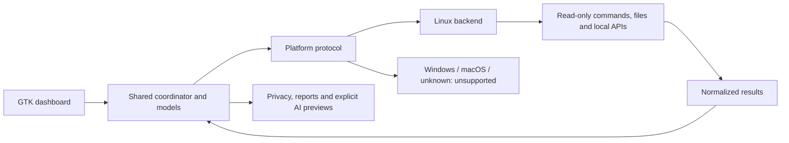

# Platform architecture — 1.4.0-dev

Linux is implemented. Ubuntu 26.04.1 / GNOME Wayland is the live-validated
desktop. Debian, Fedora, Arch and openSUSE also have real isolated userspace
evidence; a Fedora GTK client ran on the Ubuntu compositor. Other desktops
remain fixture-only. See [the precise matrix](LINUX-COMPATIBILITY.md). Windows and macOS
are prepared structurally but **UNSUPPORTED**; no diagnostics are simulated.

## Boundary and layout

The existing shared modules remain at the package root to avoid an unnecessary
import-only move to `core/`. Platform interaction was moved, not rewritten.

```text
lucy_diagnose/
  models.py              Check, Snapshot and normalized platform DTOs
  dashboard.py           Current scoped findings, severity, coverage and timestamps
  scanner.py             Background scan coordination and result normalization
  telemetry.py           Six metrics, Sample, bounded memory history
  privacy.py             Copy-only secret and identifier filtering
  reports.py, exports.py  Text / Markdown / JSON preparation
  guidance.py            Shared fallback and guidance presentation
  analysis.py            Sanitized, consented AI preview preparation
  commands.py            Command result DTO; no execution
  runner.py              Compatibility factory facade; no execution
  sources.py             Generic sources for manual/imported observations
  platform/
    base.py              Platform/sub-protocols and unsupported implementations
    detect.py            Lazy Linux / Windows / macOS / unknown selection
    linux/
      backend.py         LinuxPlatform entry point and scan-mode jobs
      distro.py          os-release parsing and family normalization
      desktop.py         Session, desktop and acquired portal bus-name detection
      capabilities.py    Command path/version capability metadata
      packages.py        dpkg / RPM / pacman / Snap / Flatpak / manual discovery
      services.py        systemd scope/state and process-only normalization
      sensors.py         Shared detailed/live sensor semantics
      telemetry.py       Lightweight /proc, hwmon and NVIDIA sampling
      overview.py        OS, CPU, memory, GPU and sensor observations
      health.py          Services, package audits, journal and OOM
      integrity.py       Bounded read-only RPM/pacman verification
      audio.py           Independent optional audio capability sources
      network.py         Interfaces, DNS, routes, ports and reachability
      storage.py         Mounts, capacity, SMART and disk sensors
      sharing.py         Desktop-aware prerequisites; no capture
      ai_stack.py        AI tools, local APIs and GPU inference visibility
      runner.py          Bounded POSIX execution and group cancellation
      guidance.py        Inert Linux manual command suggestions
      analysis_commands.py  Inert POSIX AI handoff previews
      sources.py, common.py  Evidence labels and collector helpers
    windows/__init__.py   Explicit unsupported backend
    macos/__init__.py     Explicit unsupported backend
  ui/                    GTK widgets consuming checks and live samples
  themes/                Theme catalog and application-local GTK styling
```



## Interface and worker ownership

`platform.base.Platform` defines scan jobs, runner, sampler, distro, desktop,
service, package, sensor, source, remediation and handoff-preview methods.
Typed sub-protocols define command execution, capabilities, package queries and
lightweight samples. Existing `Check` and `Sample` models are reused.

```python
from lucy_diagnose.platform import get_platform

backend = get_platform()
# Probe methods belong in a worker, not a GTK callback:
distro = backend.get_distro_info()
desktop = backend.get_desktop_info()
capability = backend.capabilities.find_command("smartctl")
packages = backend.packages.find("discord")
service = backend.get_service_status("ollama.service", scope="system")
readings, coverage = backend.get_sensor_status()
```

`scan(mode, ..., platform=backend)` obtains jobs through the interface and uses
the existing bounded four-worker executor. Jobs return `list[Check]`, never
raw command `Result` objects to GTK. Evidence can contain original output, but
only within a normalized observation with coverage, scope, source and timestamp.
The coordinator attaches inert backend guidance. The factory and backend
constructors perform no probes; explicit probe methods can perform I/O.

The backend owns the two-second sampler. Shared `Sample` and `LiveHistory`
perform no OS access. Pause epochs reset CPU baselines and invalidate stale
callbacks. GTK updates stay on its main context and exports use a worker.
Capability versions are opt-in, allowlisted and timed out.

## Models and coverage

| Model | Principal fields |
| --- | --- |
| `DistroInfo` | id, human-readable name, version, version_id, id_like tuple, family |
| `DesktopInfo` | environment, session_type, display_server, session_name, portal_backend, support |
| `CommandCapability` | name, available, path, version, source, support |
| `PackageInfo` | name, version, source, package_manager, install_path, sandboxed, confidence, support, installed, evidence |
| `ServiceState` | name, state, scope, manager, support, evidence |
| `SensorReading` | chip, label, value, unit, kind, source |
| `Check` | severity, summary, evidence, source, observed_at, count, support, inert remediation |
| `Sample` | timestamp, six metric values and notes; missing values remain `None` |

Severity and coverage are independent. `Support` has SUPPORTED, PARTIAL,
UNAVAILABLE, UNSUPPORTED and UNKNOWN. A failed service can have supported
inspection; a missing command is unavailable without being an error. Known
package absence is `installed=False`; query failure is `installed=None`.
Unknown versions/paths are `None`, not invented values. Partial/unsupported
observations prevent complete-coverage claims. Reports include coverage.

## Linux detection

Distro detection prefers `/etc/os-release`, then `/usr/lib/os-release`. Quoted
values are parsed as data, never sourced as shell code. Known IDs take precedence
over `ID_LIKE`. Families are `debian`, `fedora-rhel`, `arch`, `opensuse` and
`unknown`. Human-readable name prefers PRETTY_NAME. Unknown metadata is safe.

Desktop detection recognizes GNOME, KDE Plasma, Cinnamon, XFCE, MATE and LXQt.
Explicit session type takes priority over display-variable fallbacks. Xwayland's
DISPLAY does not override explicit Wayland. Distribution identity alone does not
imply a desktop. Owned portal bus names establish availability, not ScreenCast
dispatch ownership. Sharing selects relevant desktop units and never requires
GNOME on KDE; unidentified backends remain partial.

Packages use the native distro-family database plus applicable Snap/Flatpak
sources. openSUSE uses RPM with `rpm/zypper` as manager label. Flatpak lists
application/version/installation columns; unrelated app metadata is discarded.
Multiple installation scopes or absent version metadata are partial. Manual/
AppImage PATH fallback is low-confidence and does not establish sandbox or
package ownership. There is no full-filesystem search for application installs.
Debian state/held-package checks remain. Full Scan adds bounded RPM file
verification with verification scripts/dependency checks disabled and partial
pacman mtree checking; Quick Scan defers these. Neither performs repairs.

Services require both a discovered systemctl and a running systemd marker.
Having utilities installed alone does not establish a supported service manager.
States are RUNNING, STOPPED, FAILED, INACTIVE, NOT_FOUND, UNSUPPORTED and UNKNOWN.
System, user and process-only scopes are distinct. Canonical Id and Names
properties resolve systemd aliases without positional output assumptions. Process presence is partial
evidence, never service health. No unit is started, stopped, enabled or changed.

The Linux runner retains finite deadlines, bounded output, process-group
cancellation and disabled elevation. Shared `runner.Runner` is only a factory
facade. Linux UI environment defaults and POSIX preview commands also belong
to the backend. Nothing runs a prepared repair or AI command.

## Sensor semantics

Detailed sensors JSON and live hwmon readings share classification and selection:
k10temp/Tctl, then Tdie, Intel package, other Tctl, then remaining CPU sensors.
Within the same semantic rank the warmest reading wins. CCD/core temperatures
cannot displace an available Tctl. Cooling, GPU, storage, RAM/SPD and network
sensors are separate kinds and never CPU candidates.

Cooling classification uses discovered labels/driver families, never workstation
device IDs. Coolant temperature, pump RPM and fan RPM remain separate; unlabeled
fan channels are not guessed to be pumps. Invalid/non-finite/out-of-range values
are omitted. Missing sensors commands can fall back to readable hwmon with
partial coverage. Cooling details refresh on requested scans, not command polling.

## Deliberate shared exceptions

- `parsers.py` retains pure parsers for command formats. It has no file, command
  discovery or subprocess access and remains reusable/testable.
- `privacy.py` recognizes identifying path patterns as data. Portable username,
  home and hostname discovery supplies redaction context, not OS diagnostics.
- Exports recognize old `Ubuntu version` titles for compatibility; new probes
  emit `Operating system`.
- GUI smoke fixtures contain synthetic private paths/addresses to test redaction.
- Project-relative preferences, logs, assets and explicit exports remain shared
  application I/O. Linux command suggestions are inert backend metadata.
- User integration scripts target Linux; this phase does not implement native
  Windows/macOS packaging or rewrite installed user integration files.

## Future Windows/macOS implementations

The lazy factory selects LinuxPlatform, WindowsPlatform, MacOSPlatform or
UnsupportedPlatform. Windows/macOS currently inherit unsupported behavior.
Their imports never load Linux modules, their runners execute nothing, and
samplers return missing values. AI command syntax is also unsupported there.

A future backend supplies typed scan jobs, lightweight samples, bounded
execution/cancellation and native observation sources through the same protocols.
UI, privacy, dashboard merging, themes and report formats need no structural
reorganization. Native toolkit availability, packaging and live acceptance must
be validated on each platform before claiming support.

## Validation scope

The 176 tests preserve all 137 v1.3 cases, including architecture guards. Fixtures cover distro families, sessions, packages, service-manager
absence, sensors, sharing gaps and read-only behavior. Architecture guards enforce
execution/path boundaries and test placeholder imports in a fresh process.
Native GTK smoke, 13 theme renders, wide/compact layouts, focused-scan retention
and both exports passed on Ubuntu/GNOME and a Fedora GTK client. The suite
also passes under Debian, Fedora, Arch and openSUSE runtimes. Desktop/session
validation is narrower than userspace execution; see [V1.4-VALIDATION.md](V1.4-VALIDATION.md).
